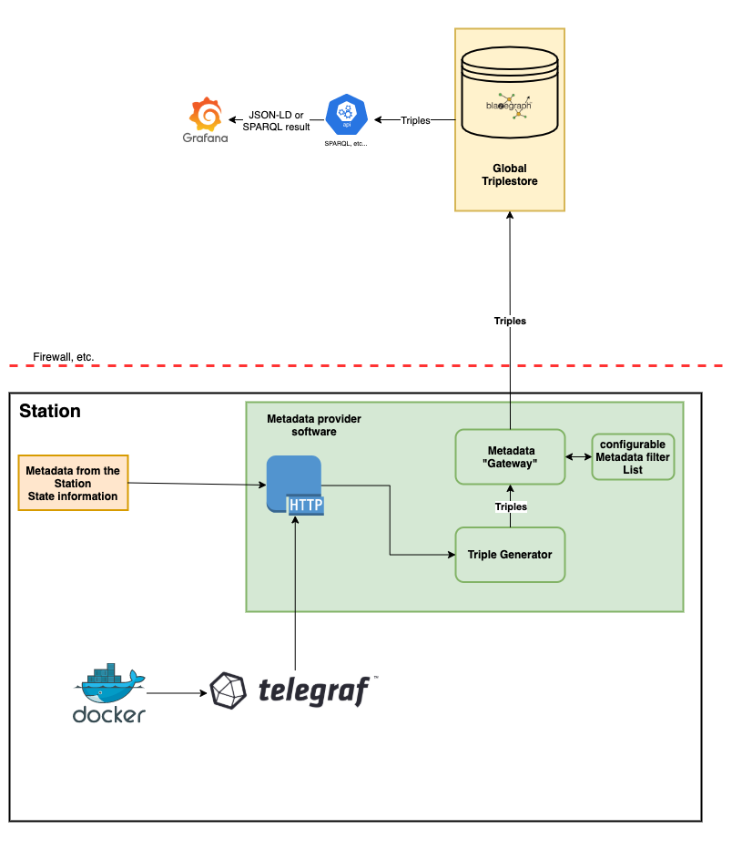

## PADME Metadata infrastructure

This repository contains the PADME metadata infrastructure. This infrastructure is responsible for providing semantic information about the different components of the PADME ecosystem. The information is represented with the [PHT metadata schema](https://github.com/LaurenzNeumann/PHTMetadata). At the moment, the infrastructure only traces information about the execution of trains.


See [the documentation](https://docs.padme-analytics.de/) for more information on the different PADME services and the service architecture. An overview of all open source services is available [here](https://git.rwth-aachen.de/padme-development).

Visit our website at [padme-analytics.de](https://padme-analytics.de).

## Deployment

To deploy this service, first view the [the instructions on how to setup your own PADME instance](https://docs.padme-analytics.de/en/how-to-deploy-padme). If you are familiar with the procedure, please define the following CI/CD variables in your mirrored repository:

| Variable Name             | Description                                                                                                                                                                                           | Example value                       |
|---------------------------|-------------------------------------------------------------------------------------------------------------------------------------------------------------------------------------------------------|-------------------------------------|
| DEPLOYMENT_TARGET_DIR     | The directory on the target host where the metadata service compose file will be stored. We recommend the provide exemplary value                                                                                | /home/deployment/Metadata/             |
| DEPLOYMENT_TARGET_HOST    | The username and host where the metadata components should be deployed to. This needs to be in the format user@host                                                                                                      | deployment@TARGET_MACHINE_HOST_NAME |
| DEPLOYMENT_TARGET_SSH_KEY | The ssh private key that should be used to authenticate the user at the target host. If you took the recommendation in our guide you can use the group-level variable $MACHINE_NAME_PRIVATE_KEY here. | MACHINE_NAME_PRIVATE_KEY            |
| METADATA_STORE_GRAPHDB_PASSWORD | The password that should be used for the PostgreSQL instance that stores the graph related data  | E3qcZYPHizoSKsyycmDX39JEU |
| METADATA_STORE_MANAGEMENTDB_PASSWORD | The password that should be used for the PostgreSQL instance that stores the management related data | jLMyXHkM8EEvv5PZ8UQN4zckU |
| METADATA_STORE_REGISTRY_KEY | The API key that is needed to provide data to the metadata store via the API. This key will be needed by other services, which is why we recommend specifying it on a GitLab group level | E0H8gXtNERXAnOKktBs0HmqTa |

Afterward execute the CI/CD pipeline to finish the deployment. 

## Overview



The achitecture consists of two parts of software: the metadata provider, which is responsible for the collection of metadata at each station and a central metadata service, collecting those information and providing interfaces for metadata retrieval.

The metadata provider software collects the metadata in two ways: Information about the state of an execution are communicated by the PHT station software over a http interface.
Metrics about each execution are collected by [telegraf](https://www.influxdata.com/time-series-platform/telegraf/) which sends it to the station software, which then calls the corrosponding endpoints of the metadata provider.
The collected information are then converted to rdf-triples, following the already mentioned schema. 
Before the triples are sent to a central service, they are filtered by a user-configurable filter.
This filter ensures that only approved information leaves the station and that the owner of the station has full control over the information flow.
Alternativly, the metadata provider can also result the rdf items instead of sending them to the central service.

The central metadata service is a triple store database, at the moment, we use blazegraph. This database stores the metadata and allows querying with SPARQL.
Grafana, which also belongs to the central service, allows visualization of the metadata with the help of a custom-build plugin and pre-made dashboards.
## How to use the software

### Starting the software:
Start the software with `python3 main.py` or with the docker image. The software expects a mongo server for storing some persistent settings.

### Configure the software

You can configure the software either with the config.ini file or with environment variables. In case both are used, the environment variables are used. However, you can mix configurations, e.g. configuring the mongo connection over the config.ini and set the station identifier with an environment variable. Afterwards, you can see a sample configuration:
```
[GENERAL]
UPDATEINTERVAL= 1

[GATEWAY]
UPLINKADRESS = http://blazegraph:9999/blazegraph/sparql

[PERSISTENCE]
URL = pht-mongo:27017
DATABASE = metadatapersistence
USERNAME = admin
PASSWORD = admin

```

In case you use the PADME stack with docker-compose everything is configured and there is no need to change ENV variables.

### configuring the filter

The filter is configured over the web interface of the station software. There, you can expand a list of all resources of the PHT schema and add them to the filter list via the button. Below the filter list you can configure whether the list should be a allow-list, meaning that only the triples with resources in this list are sent to the central service or a block-list, meaning a triple is not sent to the server if it contains a resources from the list.


## Developing

### Tests:
The source code contains various units tests and integration test. The tests can be started with `pytest`. To start a test of a single module, use `pytest metadataInfrastructure/tests/test_abc.` .

### Style:
The code style is pep8. Use autopep8 to transform code to this style automatically. Use pylint to enforce that style.
Some parts are legacy code and need to be rewritten. Those parts currently violate the code style.

### Dependencies:
- MongoDB (is currently used for storing persistent attributes)
- Python 3.8.X

The dependencies for python are stored in the setup.py
To install the dependencies, run `pip install .`
## Documentation

The documentation of the api-endpoint can be found [here](https://sascha.welten.pages.rwth-aachen.de/padme-metadata/)