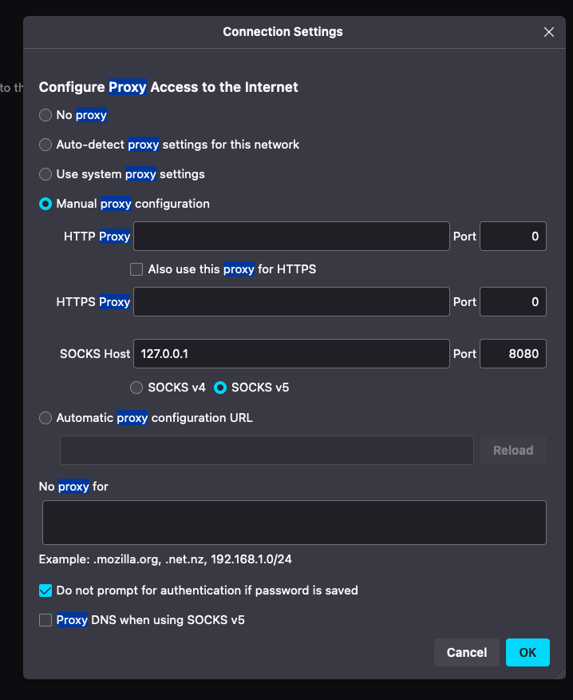

## Vault

In the PADME ecosystem, we use [HashiCorp Vault](https://www.vaultproject.io/) as a secret storage and Encryption as a Service (EaaS) provider. We use a single Vault instance that is used by different components in our architecture. After deploying your vault instance, please execute the steps listed below, depending on which components are part of your ecosystem.

See [the documentation](https://docs.padme-analytics.de/) for more information on the different PADME services and the service architecture. An overview of all open source services is available [here](https://git.rwth-aachen.de/padme-development).

Visit our website at [padme-analytics.de](https://padme-analytics.de).

## Deployment

To deploy this service, first view the [the instructions on how to setup your own PADME instance](https://docs.padme-analytics.de/en/how-to-deploy-padme). If you are familiar with the procedure, please define the following CI/CD variables in your mirrored repository:

| Variable Name             | Description                                                                                                                                                                                           | Example value                       |
|---------------------------|-------------------------------------------------------------------------------------------------------------------------------------------------------------------------------------------------------|-------------------------------------|
| DEPLOYMENT_TARGET_DIR     | The directory on the target host where the vault compose file will be stored. We recommend the provide Exemplary value                                                                                | /home/deployment/Vault/             |
| DEPLOYMENT_TARGET_HOST    | The username and Host where Vault should be deployed to. This need to be in the format user@host                                                                                                      | deployment@TARGET_MACHINE_HOST_NAME |
| DEPLOYMENT_TARGET_SSH_KEY | The ssh private key that should be used to authenticate the user at the target host. If you took the recommendation in our guide you can use the group-level variable $MACHINE_NAME_PRIVATE_KEY here. | MACHINE_NAME_PRIVATE_KEY            |

Afterward execute the CI/CD pipeline to finish the deployment. Then proceed with the setup as described in the following.

## Setup

The following describes the setup which **needs to be executed by hand** on the target machine, after vault has been deployed. There are three steps: The first one needs to be executed in any case. Step number 2 should be executed because it is needed for the Central Service (CS), which is a required service in your ecosystem. The last and third step is needed when your ecosystem should also contain a Train Creator or Train Store house.

### 1. General

#### Initialize vault

The first step of the setup is to initialize and unseal the vault instance. This and the following configurations will be performed using the vault CLI. For this, execute the following command on the target machine to get CLI access to the vault container:

```
docker exec -it vault-vault-1 /bin/ash
```

Now perform the initial vault setup. It is very important to **store the resulting root_token and token used to unseal the vault instance**. Those tokens will be needed after every restart of the vault container (to unseal) and for every configuration change (as in the following). Perform the vault initialization:

```
vault operator init -tls-skip-verify -key-shares=1 -key-threshold=1
```
(Change the number of key-shares and the key-threshold as desired)

Now unseal the vault:

```
vault operator -tls-skip-verify unseal
```
(Enter key potion upon-request. If you changed the key-threshold above, repeat this for the required number of keys till the vault is unsealed)

Since the unsealing of vault is required after every container/machine restart, we provide a CI/CD job that can perform the unsealing. If you would like to use this job, add the unseal keys to a CI/CD variable called ```VAULT_UNSEAL_POTIONS```. If you have more than 1 key, they should be separated by new lines.

After setting the variable, you can unseal vault be (re)running the unseal_vault CI/CD job.

With the initial setups finished, you can now proceed with the configuration of vault for the PADME ecosystem.

#### Login

The following configurations will be performed using the vault CLI. 
Now login to the instance (enter the root token acquired during the previous step when asked):

```
vault login -tls-skip-verify
```

Lastly, we will enable the [AppRole Authentication mechanism](https://developer.hashicorp.com/vault/docs/auth/approle), which is used by both vault clients within PADME:

```
vault auth enable -tls-skip-verify approle
```

Now you are ready to perform the application specific configurations in steps 2 and 3.

### 2. Central Service (CS)

For the Central Service (CS) Vault setup perform the following steps:

Create a key-value engine at the /public_key path:
```
vault secrets enable -tls-skip-verify -version=2 -path=public_key kv-v2
```

Enable the transit engine:
```
vault secrets enable -tls-skip-verify transit
```

Create a policy for the CS to access the created engines. For this, create a files named ```centralervice.hcl``` in the current folder. The file should have the following content:

centralservice.hcl
```
path "public_key/*" {
  capabilities = ["create", "read", "update", "patch", "delete", "list"]
}
path "transit/*" {
  capabilities = ["create", "read", "update", "patch", "delete", "list"]
}
```

Now create the policy:
```
vault policy write -tls-skip-verify centralservice centralservice.hcl
```

Create a AppRole that will be used by the CS that uses the created policy:

```
vault write -tls-skip-verify auth/approle/role/centralservice \
    bind_secret_id=true \
    token_policies="centralservice" \
    secret_id_ttl=0 \
    token_ttl=0 \
    token_max_ttl=0 \
    secret_id_num_uses=0
```

Lastly, read the ```role-id``` and ```secret-id``` for the AppRole. The output of the following commands will need to be configured in the CS repository via environment variables for the deployment:

```
vault read -tls-skip-verify auth/approle/role/centralservice/role-id
```

```
vault write -f -tls-skip-verify auth/approle/role/centralservice/secret-id
```

### Train creator / Train store

For the Train creator / Train store Vault setup perform the following steps.´

Create a key-value engine at the /gitlab path:
```
vault secrets enable -tls-skip-verify -version=2 -path=gitlab kv-v2
```

Create a policy for the Train creator / Train store to access the created engine. For this, create a files named ```train-creator.hcl``` in the current folder. The file should have the following content:

train-creator.hcl
```
path "gitlab/*" {
  capabilities = ["create", "read", "update", "patch", "delete", "list"]
}
```

Now create the policy:

```
vault policy write -tls-skip-verify train-creator train-creator.hcl
```

Create a AppRole that will be used by the Train creator / Train store and uses the created policy:

```
vault write -tls-skip-verify auth/approle/role/train-creator \
    bind_secret_id=true \
    token_policies="train-creator" \
    secret_id_ttl=0 \
    token_ttl=0 \
    token_max_ttl=0 \
    secret_id_num_uses=0
```

Lastly, read the ```role-id``` and ```secret-id``` for the AppRole. The output of the following commands will need to be configured in the Train creator and Train store repositories via environment variables for the deployment:

```
vault read -tls-skip-verify auth/approle/role/train-creator/role-id
```

```
vault write -f -tls-skip-verify auth/approle/role/train-creator/secret-id
```

## Accessing the vault UI

Our vault configuration binds the web interface to the port ```127.0.0.1:8215``` on the target machine. Therefore, this port is only accessible via an ssh tunnel. Establish an ssh tunnel via the following command:

```
ssh -D 8080 -C -N user@yourserver
``````
(replace the user and server name and port if needed)

Now configure your browser or system to use this local socks proxy. For example, in firefox this can be done by specifying the following network settings (see [the firefox documentation](https://support.mozilla.org/en-US/kb/connection-settings-firefox)):



Moreover, in Firefox you need to alter a setting to allow localhost proxies, see the [description here](https://stackoverflow.com/a/57419409/5589776).

Now you should be able to access the vault web UI via the following link: [https://127.0.0.1:8215](https://127.0.0.1:8215). However, your browser will probably show a certificate error. This is due to our setup: With the start of vault we will create a set of certificates. Those are self signed. Our services will automatically mount the correct client certificates but this is not easily possible for you. Therefore, please skip the security warning in your browser. This is not a security problem because the traffic will already be encrypted by the ssh tunnel.